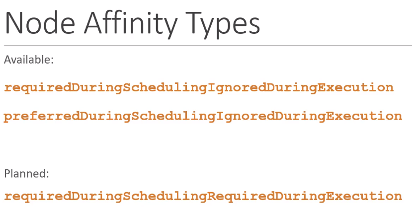
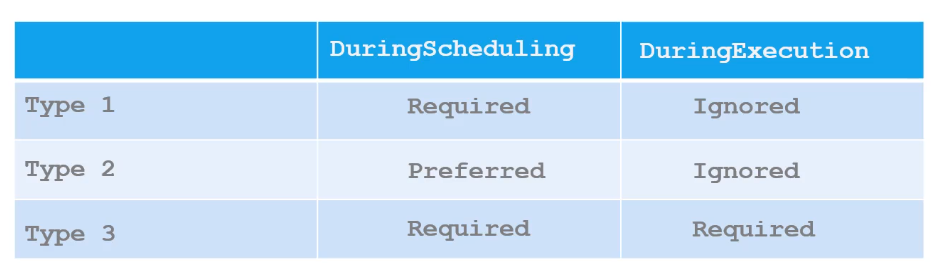
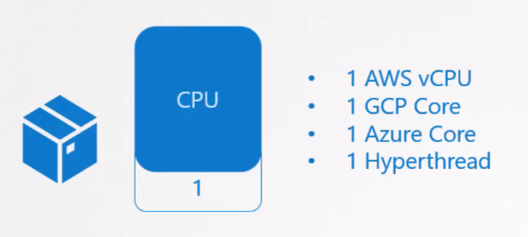
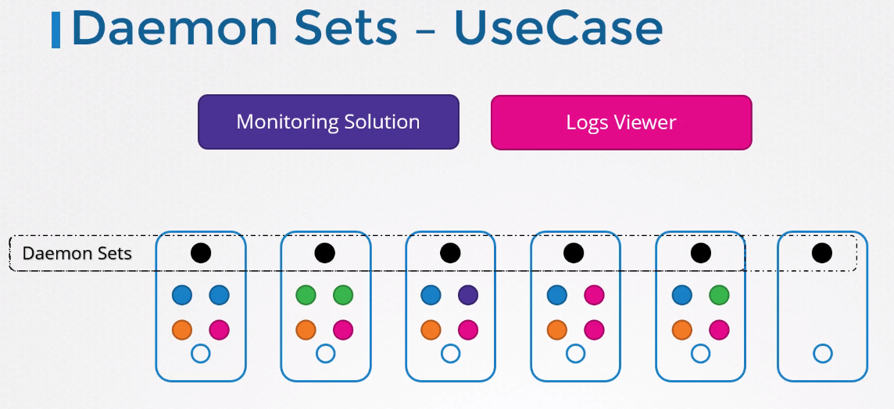
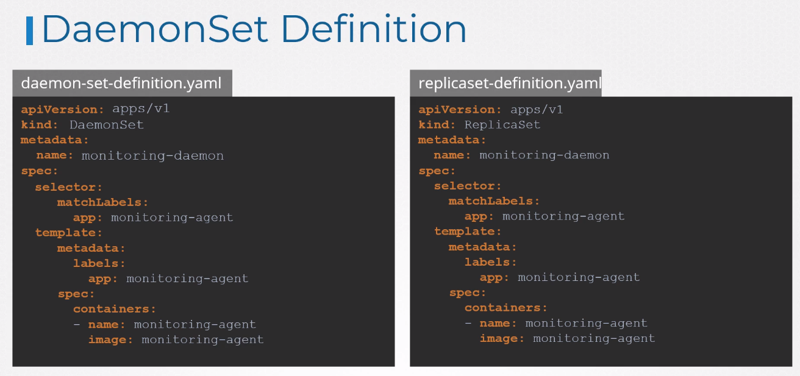
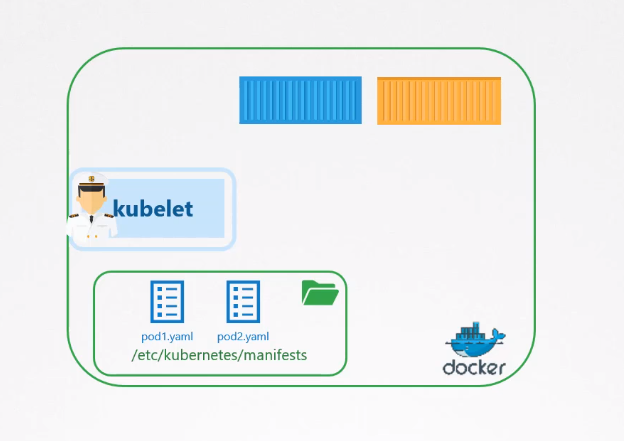
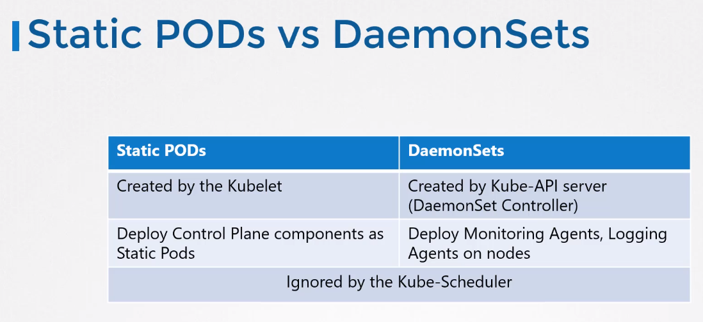

# Kubernetes

## Scheduling

### Manual Scheduling

- We can manually assign our pods to nodes ( if the scheduler is not exists)

### Labels and Selectors

- select items on kubernetes with selector

```bash
kubectl get po --selector app=App1
kubectl get po --show-labels
kubectl get pods -l env=dev --no-headers | wc -l
kubectl get po -l env=dev, bu=finance, tier=frontend
```

- also we use matchLabels to match object with each other.

### Annotations

- gives details to some object on K8s.

### Taints and Tolerations

- taint ile node üzerine bir label ekliyoruz. Eger pod'da ayni label (taint)
  eklenirse, olusturdugumuz pod, bu node icine yerlestirilebilyor.

```bash
kubectl taint nodes node-name key=value:taint=effect

```

- 3 tane ayri taint var

  - NoSchedule
  - PreferNoSchedule
  - NoExecute

```bash
 kubectl taint nodes node01 app=blue:NoSchedule
```

### Tolerations

- Taint olayini yaml file ile pod'lara tanimliyoruz.

```bash
apiVersion: v1
kind: Pod
metadata:
    name: myapp-pod
spec:
    container:
        - name: nginx-container
          image: nginx
    tolerations:
        - key: "app"
          operator:"Equal"
          value: "blue"
          effect:"NoSchedule"

```

- to see the taints on nodes

```bash
kubectl describe node kubemaster | grep Taint

kubectl describe  node node01 | grep Taint

```

- Tainted any nodes with cli

```bash
kubectl taint nodes  node01 spray=mortein:NoSchedule
```

- taint kaldirmak icin (make untainted)

```bash

kubectl taint nodes  node01 spray=mortein:NoSchedule

```

### Node Selectors

```bash
apiVersion: v1
kind: Pod
metadata:
    name:myapp-pod
spec:
    containers:
        - name: data-processor
          image: data-processor
    nodeSelector:
        size: Large
```

- Label the nodes

```bash
kubectl label nodes <node-name> <label-key>=<label-value>
```

### Node Affinity




- Types
  - requiredDuringSchedulingIgnoredDuringExecution available
  - prefferedDuringSchedulingIgnoredDuringExecution available
  - requiredDuringSchedulingRequiredDuringExecution planned

```bash
apiVersion: v1
kind: Pod
metadata:
  name: nginx
spec:
  affinity:
    nodeAffinity:
      requiredDuringSchedulingIgnoredDuringExecution:
        nodeSelectorTerms:
        - matchExpressions:
          - key: disktype
            operator: In
            values:
            - ssd
  containers:
  - name: nginx
    image: nginx
    imagePullPolicy: IfNotPresent

```

- Show labels

```bash
kubectl get node --show-labels
```

- Label the nodes

```bash
kubectl label nodes node01 color=blue
```

### Resource Requirements and Limits

```bash
apiVersion: v1
kind: Pod
metadata:
  name: simple-webapp-color
  labels:
    name: simple-webapp-color
spec:
  containers:
  - name: simple-webapp-color
    image: simple-webapp-color
    ports:
      - containerPort: 8080
    resources:
      requests:
      memory: "1Gi"
      cpu: 1
    limits:
      memory: "2Gi"
      cpu: 2
```




- K8s 1vCPU and 512Mi limit for Pods default

### Deamon Sets




- Get all deamonsets

```bash
kubectl get deamonsets (ds) --all-namespaces
```

### Static Pods

- on the Nodes we located yaml file in /etc/kubernetes/manifests, then kubelet
  automatically create static pods on Nodes.



- we should define staticPodPath in konfig.yaml file staticPodPath: /ect/kubernetes/manifests

- we use staticpods to create controlplane components like controller-manager, etcd and apiserver



- ssh into nodes

```bash
ssh node01
```

- find static pod yaml file directory

first we have to check all processes then find the directory of config.yaml file.

```bash
ps -ef | grep kubelet
```

```bash
grep -i staticPod /var/lib/kubelet/congif.yaml
```
