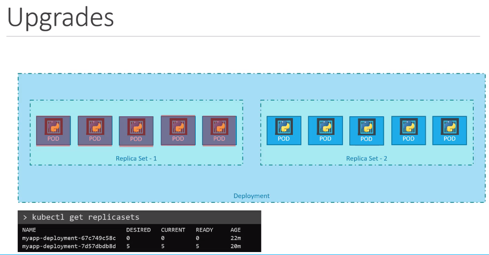
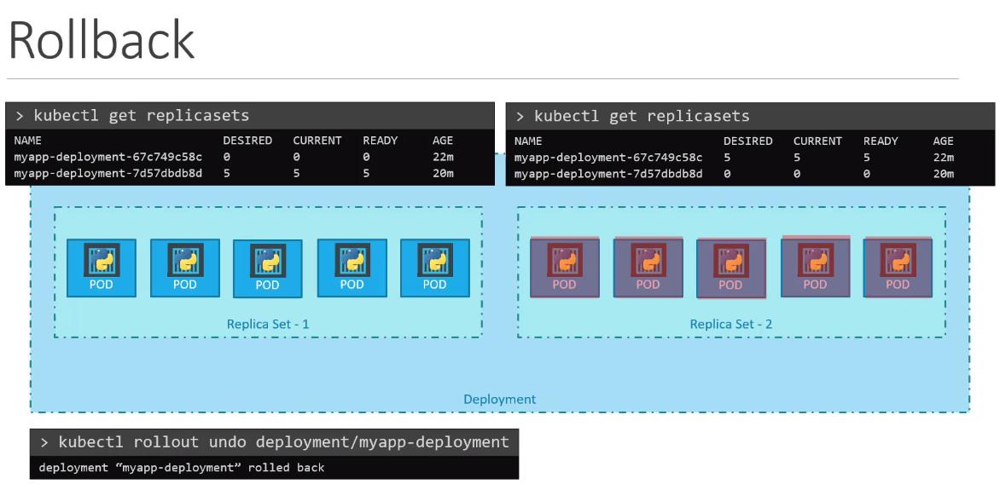
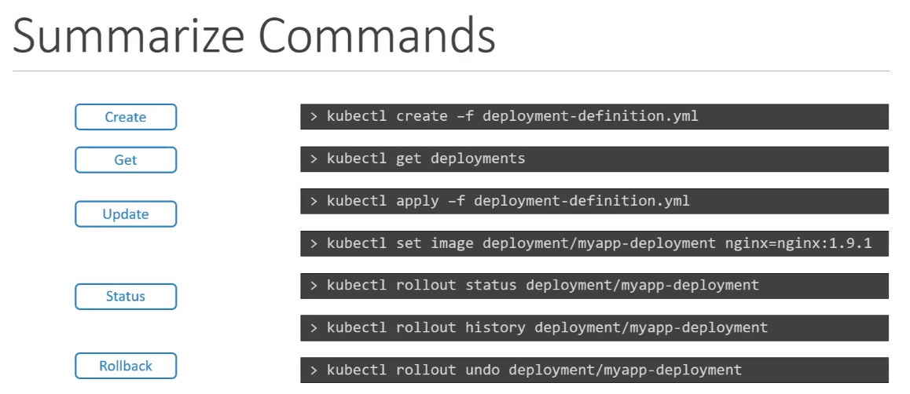

# Application Management Strategy

## Deployment Strategy

- Recreate

- Rolling Update (Default deployment Strategy)

  - we can easily update our image value on our yaml file.

```bash
kubectl edit deployment <deployment-name>

kubectl set image deployment/myapp-deployment nginx=nginx:1.9.1 # this method could not update yaml file. BE CAREFUL
```





## Commands and Arguments

### ConfigMap

- create a configMap(imperative)

```bash
kubectl create configmap <config-name> --from-literal=<key>=<value>
```

- create a configMap from file(imperative)

```bash
kubectl create configmap <config-name> --from-file=<path to file>
```

- Get configmaps and inspect them

```bash
kubectl get configmaps

kubectl describe configmaps

```

### Secrets

- create a secret with imperative way

```bash
kubectl create secret generic <secret-name> --from-literal=<key>=<value>

kubectl create secret generic app-secret --from-literal=DB_Host=mysql \
                                         --from-literal=DB-username=user\
                                         --from-literal=DB-password=password
```

- create secret from file (imperative way)

```bash
kubectl create secret generic <secret-name> --from-file=<path to file>
```

- create hash value

```bash
echo -n "mysql" | base64
echo -n "user" | base64
echo -n "password" | base64
```

- get secret object yaml file

```bash
kubectl get secret app-secret -o yaml
```

A note about Secrets!
Remember that secrets encode data in base64 format. Anyone with the base64 encoded secret can easily decode it. As such the secrets can be considered as not very safe.

The concept of safety of the Secrets is a bit confusing in Kubernetes. The kubernetes documentation page and a lot of blogs out there refer to secrets as a "safer option" to store sensitive data. They are safer than storing in plain text as they reduce the risk of accidentally exposing passwords and other sensitive data. In my opinion it's not the secret itself that is safe, it is the practices around it.

Secrets are not encrypted, so it is not safer in that sense. However, some best practices around using secrets make it safer. As in best practices like:

Not checking-in secret object definition files to source code repositories.

Enabling Encryption at Rest for Secrets so they are stored encrypted in ETCD.
(https://kubernetes.io/docs/tasks/administer-cluster/encrypt-data/)
Also the way kubernetes handles secrets. Such as:

A secret is only sent to a node if a pod on that node requires it.

Kubelet stores the secret into a tmpfs so that the secret is not written to disk storage.

Once the Pod that depends on the secret is deleted, kubelet will delete its local copy of the secret data as well.

Read about the protections and risks of using secrets here
(https://kubernetes.io/docs/tasks/administer-cluster/encrypt-data/)
Having said that, there are other better ways of handling sensitive data like passwords in Kubernetes, such as using tools like Helm Secrets, HashiCorp Vault. I hope to make a lecture on these in the future.

### Multi-Container PODs

- inspect any file inside of the pod

```bash
kubectl -n elastic-stack exec -it app cat /log/app.log
```

- Multi-container PODs Design Patterns
  There are 3 common patterns, when it comes to designing multi-container PODs. The first and what we just saw with the logging service example is known as a side car pattern. The others are the adapter and the ambassador pattern.

  But these fall under the CKAD curriculum and are not required for the CKA exam. So we will be discuss these in more detail in the CKAD course.

- In a multi-container pod, each container is expected to run a process that stays alive as long as the POD's lifecycle. For example in the multi-container pod that we talked about earlier that has a web application and logging agent, both the containers are expected to stay alive at all times. The process running in the log agent container is expected to stay alive as long as the web application is running. If any of them fails, the POD restarts.

But at times you may want to run a process that runs to completion in a container. For example a process that pulls a code or binary from a repository that will be used by the main web application. That is a task that will be run only one time when the pod is first created. Or a process that waits for an external service or database to be up before the actual application starts. That's where initContainers comes in.

An initContainer is configured in a pod like all other containers, except that it is specified inside a initContainers section, like this:

- When a POD is first created the initContainer is run, and the process in the initContainer must run to a completion before the real container hosting the application starts.

You can configure multiple such initContainers as well, like how we did for multi-pod containers. In that case each init container is run one at a time in sequential order.

If any of the initContainers fail to complete, Kubernetes restarts the Pod repeatedly until the Init Container succeeds.

```yaml
apiVersion: v1
kind: Pod
metadata:
  name: myapp-pod
  labels:
    app: myapp
spec:
  containers:
    - name: myapp-container
      image: busybox:1.28
      command: ["sh", "-c", "echo The app is running! && sleep 3600"]
  initContainers:
    - name: init-myservice
      image: busybox:1.28
      command:
        [
          "sh",
          "-c",
          "until nslookup myservice; do echo waiting for myservice; sleep 2; done;",
        ]
    - name: init-mydb
      image: busybox:1.28
      command:
        [
          "sh",
          "-c",
          "until nslookup mydb; do echo waiting for mydb; sleep 2; done;",
        ]
```

### Self Healing Applications

Kubernetes supports self-healing applications through ReplicaSets and Replication Controllers. The replication controller helps in ensuring that a POD is re-created automatically when the application within the POD crashes. It helps in ensuring enough replicas of the application are running at all times.

Kubernetes provides additional support to check the health of applications running within PODs and take necessary actions through Liveness and Readiness Probes. However these are not required for the CKA exam and as such they are not covered here. These are topics for the Certified Kubernetes Application Developers (CKAD) exam and are covered in the CKAD course.
