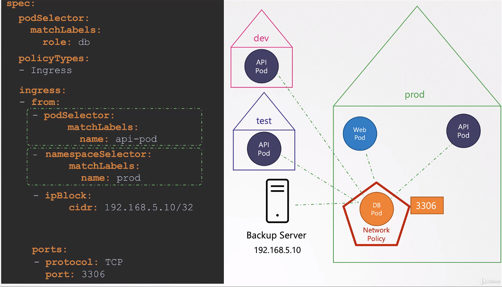

# Security

## TLS Certificates

```bash

openssl x509 -in /etc/kubernetes/pki/etcd/server.crt -textD # describe etcd certificate
```

## Role Based Access COntrols (RBAC)

- get roles

```bash
kubectl get roles
```

- get role bindings

```bash
kubectl get rolebindings
```

- describe the roles

```bash
kubectl describe role developer
```

- check access

```bash
kubectl auth can-i create deployments # returns yes or no
kubectl auth can-i delete nodes # returns yes or no

kubectl auth can-i create pods --as dev-user  # we could as as a specific user

kubectl auth can-i create pods -as dev-user --namespace test # check access based on namespace
```

## Private Repository

- create a RegCred ( private registry credientials)

```bash
kubectl create secret docker-registry regcred \
--docker-server=<your-registry-server> \
--docker-username=<your-name> \
--docker-password=<your-pword> \
--docker-email=<your-email>


```

```bash
kubectl create secret docker-registry private-regcred \
--docker-server=myprivateregistry.com:5000 \
--docker-username=dock-user \
--docker-password=dock-password \
--docker-email=dock_user@myprivateregistry.com

```

## Network Policy


